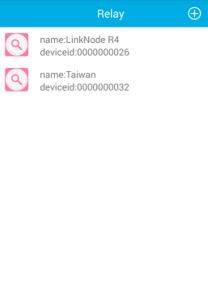
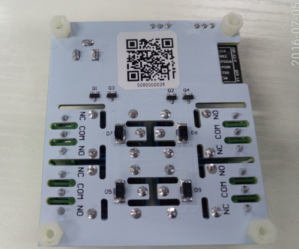
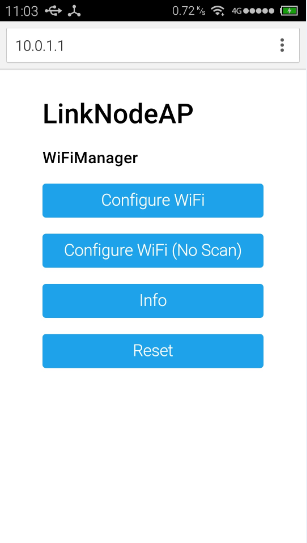
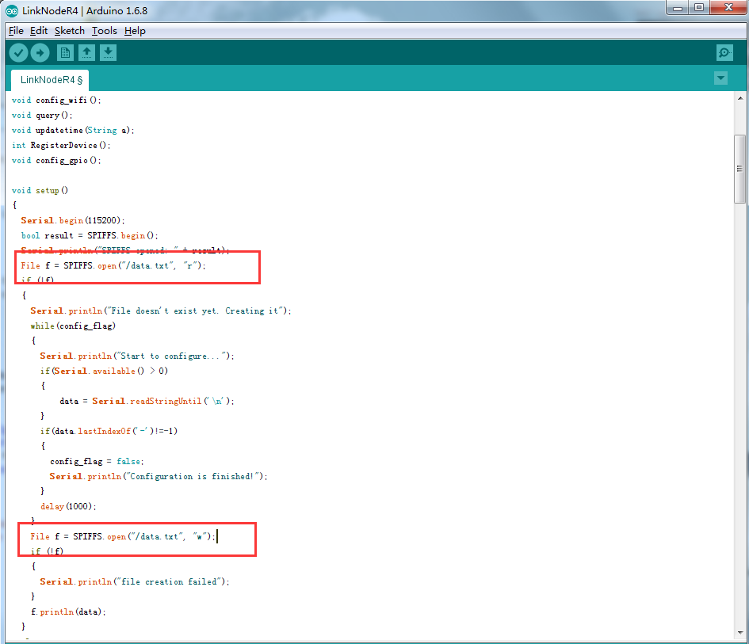
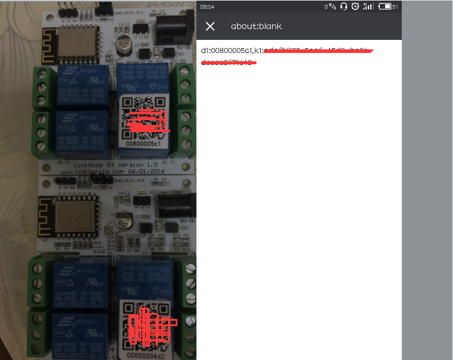

# How to use Android APP to control LinkNode R4

LinkNode R4 is an open source 4-Channel relay controller which is powered by the ESP8266 WiFi SoC.

The following will introduce how to use Android APP to control the LinkNode R4.

## Steps

#### 1. Install Android and iOS APP
* Download the APK file from the [github](https://github.com/delongqilinksprite/LinkNodeR4-app.git) and install it.
* if your equipment is iphone/ipad,you can get the app form appstore and name is "LinkNode Relay".  
* iOS App download link ：[LinkNode Relay](https://itunes.apple.com/cn/app/linknode-relay/id1163468201?mt=8)

#### 2. Login LinkSpriteIO
* If you never register an account on LinkSpriteIO, please enter Email and your password, then click the **SIGN IN** button
* If you have an account on LinkSpriteIO, please enter Email and your password, then click the **REGISTER** button

#### 3. Go to Relay device list
* Click the plus icon on the upper right quarter to add a new LinkNode R4.

#### 4. Scan the QRcode
* Get the device information and register it to your account.

#### 5. Configure to accece WiFi AP
* Supply the power for LinkNodeR4, the LinkNode R4 will create a AP called **LinkNodeAP**
* Use your mobile phone to connect this AP
* Open a browser and enter the ip address **10.0.1.1** and you will see the following website:

    
  
* Click the button **configure WiFi**
* Select your WiFi AP which you want to connect and enter your wifi password.
* If connecting failed, you can go to the same website to configure it again.
* After that, LinkNode R4 will connect to Linksprite IO via the internet.

#### 6. Control your 4-channel relay
* control the button on the right side to turn on or off the relays, and you can click the relay's name to change it.

# How to update LinkNode R4 firmware
If you wipe the original firmware of LinkNode R4, you now need to restore the previous firmware, then follow the following steps can be restored.

* Download the [LinkNode R4 code](https://github.com/delongqilinksprite/LinkNodeR4-app/tree/master/code)
* Compile the code,this step can be learn from [LinkNodeD1](http://linksprite.com/wiki/index.php5?title=LinkNode_D1)
* Upload the code by Arduino IDE

###### Note: Apikey,deviceID and wifi message are written into the flash inside,if you want to erase the apikey and deviceID,you could change the code.but wifi message can't be erased!

* Open the Arduino IDE Serial Monitor,you will see "start to configure..."
* Use your cell phone scan the qr,get the akikey and deviceID
* send the deviceID and apikey by Serial Monitor,when you see "Configuration is finished!",that's done

###### Note: Scan QR result is:C1:0080000xxxx,D1:xxxxxxxx-xxxx-xxxx-xxxxxxxxxxxx-xxxxxxxxxxxx,we just send:0080000xxxxxxxxxxxx-xxxx-xxxx-xxxxxxxxxxxx-xxxxxxxxxxxx,no space.

